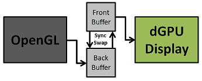
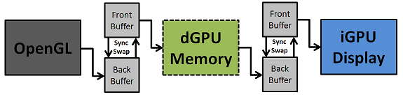

+++
title = "在 NVIDIA Optimus 笔记本折腾独立显卡"
date = 2018-05-26 13:23:00+08:00
tags = ["gpu", "linux"]
[taxonomies]
categories = ["正文"]
tags = ["linux", "nvidia"]
+++

一直以来我在我的神船上用的 Intel/NVIDIA 双卡方案都是 the good old bumblebee，并
且 N 卡一直处于关闭状态，因为平常只是看看视频，要玩游戏时偶尔开开 primusrun，日
子过得还算不错，平常的温度只有 40 来度左右，续航也可以勉强达到 5 小时。

但是这样有一个坏处：HDMI 和 MiniDP 口是无法拿来当视频输出用的，因为它们都直接接
到了 N 卡上，于是一直以来外接显示器都在用 the bad old VGA。最近突然兴起，使用显
卡什么的不管，起码把 HDMI 输出配好吧，于是就尝试了下面提到的两种方法，最后反而把
N 卡变成主要显卡了（x。

<!-- more -->

## 预备知识 - PRIME

PRIME 是 Linux 内核支持多块 GPU 一起处理显示的技术，对于现在的双显卡笔记本来说，
PRIME GPU offloading 跟 Reverse PRIME 都是可以让独立显卡（dGPU）负责渲染的方法。
PRIME 一开始在 2010 年开始开发，后来在 2011 年迁移到了当时内核提出可以让不同设备
共享 DMA 缓冲区的 DMA-BUF 技术，之后 i915、radeon、nouveau 都陆续支持了 PRIME。

NVIDIA 目前的私有驱动不知从何时开始也支持 PRIME，但就目前来看，~~私有驱动只支持
Reverse PRIME，GPU offloading 貌似还无法使用。~~

> 更新：NVIDIA 驱动从 435.17 版本开始支持 PRIME offloading 了，需要搭配 Xorg
1.20.6 使用。

下面分别说明两种模式需要怎么配置，使用的发行版为 Arch Linux。

## PRIME GPU Offloading

注：上文也说到 NVIDIA 驱动从 435.17 版本开始支持 PRIME offloading 了，但需要搭配
Xorg 1.20.6 使用。

如果你打算用 nouveau，先把驱动（xf86-video-nouveau）安装上。如果没有安装 xrandr
的话也一并安装。如果安装了 bbswitch、bumblebee 之类的话，先把他们卸载掉，因为
nouveau 直接使用内核提供的电源管理，不必用 bbswitch 关闭独显；bumblebee 则是带了
一份 blacklist 掉 nouveau 的 modprobe 配置，不卸载掉开源驱动就起不来了。

> P.S. 如果你的 Optimus 笔记本在使用 nouveau 或者 bumblebee 的时候会 hang 住，可
> 能是[这个问题](https://wiki.archlinux.org/index.php/NVIDIA_Optimus#Lockup_issue_.28lspci_hangs.29)

先重启看看正不正常，如果可以正常开机了，用 xrandr 检查是不是已经有两个 provider
（示例输出来自 Arch Wiki）：

```bash
$ xrandr --listproviders
Providers: number : 2
Provider 0: id: 0x7d cap: 0xb, Source Output, Sink Output, Sink Offload crtcs: 3 outputs: 4 associated providers: 1 name:Intel
Provider 1: id: 0x56 cap: 0xf, Source Output, Sink Output, Source Offload, Sink Offload crtcs: 6 outputs: 1 associated providers: 1 name:radeon
```

默认情况下使用的是内置的 Intel，在上面 xrandr 输出中可以看到 name:Intel 或者
name:modesetting 的 provider，以及他们具有的功能。接下来使用xrandr
--setprovideroffloadsink provider sink来使provider具有渲染的内容发送给sink显示的
能力：

```bash
$ xrandr --setprovideroffloadsink nouveau modesetting
```

上面的命令意味着让 nouveau 可以把渲染好的画面发送给 modesetting（Intel 的驱动）
来显示，即 nouveau→modesetting。此时 GPU offloading 已经可用了，给需要独立显卡的
程序设置环境变量`DRI_PRIME=1`就可以使用独显来渲染，用集显来显示。这种方式下跟之前
的 Bumblebee 效果是类似的，不过由于 nouveau 目前的性能非常差，使用 PRIME GPU
offloading 没有什么优势；但如果是 ATI 的显卡，在 AMD 的不懈努力下开源驱动的性能
已经可以和私有驱动媲美，因此可以直接使用。

如果使用 GNOME 桌面环境，还可以直接使用菜单来控制程序是否运行在独立显卡上。

在不使用独立显卡运行程序时，独显在空闲了几秒之后会进入 DynOff 状态，此时如果运行
一个需要独显的程序，独显会自动激活。不过就我试用的情况来看，965m 即使处在 DynOff
的状态下，发热量相对于使用 bbswitch 关闭独显还是很可观的，不知道这是由于 nouveau
不能降低独显的功耗，还是内核需要保持独显低等级的供电导致的。

## Reverse PRIME

Reverse PRIME 与上面的刚好相反：不是使用独显渲染并把结果发送给集显，而是使用集显
渲染，并把画面发送给独显再显示到外界显示器上。Reverse PRIME 既可以使用开源驱动也
可以使用私有驱动，但是不知为何我在使用私有驱动时不能从 xrandr 看到独显的
provider，因此只叙述使用开源驱动的方法。

其实很简单，使用

```bash
$ xrandr --setprovideroutputsource nouveau modesetting
```

就可以将集显渲染的画面发送给独显，即 nouveau←modesetting，这个方向跟上面的 GPU
offloading 是相反的，因此才被称为「Reverse PRIME」。命令运行完后，连接上外接显示
器，就可以从 xrandr 或者图形界面的显示器设置工具里看到外接显示器，对它进行分辨率
、方向、位置的设置，这和普通地将显示器接到集显上的接口是相同的，使用上也没有什么
区别，唯一的缺点就是独显发热比较烫了。另外由于所有的渲染都是集显做的，因此如果集
显威力不够强大，接一个分辨率比较高的屏幕可能会卡卡的。

## 终极杀器 - 将 N 卡作为主要显卡

本来完成了上面的 Reverse PRIME 之后外接显示器已经可以正常使用了，但是由于换用了
开源驱动，导致虽然有一定的电源管理功能，但是发热量还是很严重，于是不如要做就做彻
底，续航干脆就不要了，直接使用 N 卡作为主要的显卡，使用私有驱动，集显只用来输出
到内置屏幕上。

整个过程分为好几步。首先安装nvidia私有驱动。如果安装了开源驱动的话就卸载掉，虽然
不卸载好像也可以，但是为了避免出现更奇怪的问题，还是先删掉吧。

### 配置 Xorg 使用 N 卡作为主要显卡

更新：不知哪个更新开始（惭愧）Arch Linux 上的 nvidia-utils
包已经自带了一份 Xorg 配置，默认在
`/usr/share/X11/xorg.conf.d/10-nvidia-drm-outputclass.conf`，如果没有的话可以把
下面的内容放到 `/etc/X11/xorg.conf.d/10-nvidia-drm-outputclass.conf`：

```
Section "OutputClass"
    Identifier "intel"
    MatchDriver "i915"
    Driver "modesetting"
EndSection

Section "OutputClass"
    Identifier "nvidia"
    MatchDriver "nvidia-drm"
    Driver "nvidia"
    Option "AllowEmptyInitialConfiguration"
    Option "PrimaryGPU" "yes"
    ModulePath "/usr/lib/nvidia/xorg"
    ModulePath "/usr/lib/xorg/modules"
EndSection
```

更新2：某次更新之后 Arch 上面的配置已经没有 PrimaryGPU 那一行了，需要手动把上面
的内容放到 `/etc/X11/xorg.conf.d/` 下。

注意！完成了这一步之后先不要重启，因为还没有将笔记本内置屏幕设置为 N 卡的输出，
否则可能重启之后黑屏。不过如果有外接显示器的话也许可以点亮。

### 将集显配置成 Reverse PRIME

这里和上面的 Reverse PRIME 一样，直接使用 xrandr 即可，不过安装了私有驱动的
provider 叫做 NVIDIA-0。如果不叫这个名字的话可以用xrandr --listproviders查看。然
后用

```bash
$ xrandr --setprovideroutputsource modesetting NVIDIA-0 $ xrandr --auto
```

就可以将集显作为独显的输出。如果想要开机自动完成设置，需要在某处自动运行的脚本里
写入上面的命令，比如使用 sddm 作为登录管理器的话，可以写到
/usr/share/sddm/scripts/Xsetup文件里。

确保这些步骤无误后，重启看看这些设置是否生效了，如果图形界面能成功启动，运行
glxinfo 应该可以看到 OpenGL 的 vendor 已经是 NVIDIA：

```
$ glxinfo | grep "OpenGL vendor" OpenGL vendor string: NVIDIA Corporation
```

### 启用 PRIME Synchronization

虽然成功让独显作为默认显卡了，但是很有可能出现严重的画面撕裂，这是因为原本的垂直
同步只需要保证 GPU 不会在显示器没显示完上一帧的时候就开始更新显存，而在这里多了
一步从独显到集显的过程，只同步应用程序到独显是不足的。



*普通的垂直同步*



*PRIME Synchronization*

所幸的是目前 NVIDIA 私有驱动已经实现了 PRIME Synchronization，只需要满足两个条件
：

1. Intel 的驱动是内核的 modesetting 驱动，在 Arch Linux 下就是不安装
   xf86-video-intel
2. 打开 NVIDIA 驱动的 Kernel Mode Setting 支持

1 很容易做到，2 需要添加一个内核命令行参数 `nvidia_drm.modeset=1`，并且需要将几
个nvidia 相关的内核模块打包进 initramfs 中，而且每次私有驱动升级都需要打包新的
nvidia 内核模块进 initramfs，还好 pacman hooks 可以自动完成这些工作。

首先将 nvidia 内核模块打包进 initramfs，编辑 mkinitcpio.conf，在 MODULES 数组里
添加以下模块：

```bash
# in /etc/mkinitcpio.conf
MODULES=(nvidia? nvidia_modeset? nvidia_uvm? nvidia_drm?)
```

保存后运行 `mkinitcpio -P` 重新生成 initramfs。问号表示这些模块不存在时也不报错
，以后如果想换回开源驱动又忘了改 mkinitcpio.conf 的话，生成 initramfs 时不会爆炸
。

最后为了保证每次私有驱动更新都会重新生成 initramfs，添加一个新的 pacman hook：

```/etc/pacman.d/hooks/nvidia.hook```

```
[Trigger]
Operation=Install
Operation=Upgrade
Operation=Remove
Type=Package
Target=nvidia
Target=linux
# Change the linux part above and in the Exec line if a different kernel is used

[Action]
Description=Updating Nvidia module in initcpio...
Depends=mkinitcpio
When=PostTransaction
NeedsTargets
Exec=/bin/sh -c 'while read -r trg; do case $trg in linux) exit 0; esac; done; /usr/bin/mkinitcpio -P'
```

这样在每次 nvidia 包有变动的时候都会重新生成 initramfs，从此可以放心地滚系统了。

重启之后，PRIME synchronization 就会自动开启，画面撕裂也就没有了。（注：Linux 内
核 5.4.x 时期的 nvidia 驱动会造成 PRIME Synchronization 失效，到 5.5 之后修复）
而且经过我的测试，此时就算将 KDE 混成的垂直同步与 nvidia-config 的垂直同步都关闭
掉，也不会有画面撕裂问题，可以说又解决了我一心头之患了。

## 结束语

到这里这台神船就正式变成了一台台式机，由 N 卡强力渲染所有画面，玩 osu 也可以稳定
在 240fps，外接显示器也没有问题了。不过所花费的代价就是独显一直运行所带来的功耗
和发热，续航直接从 5 小时缩短为 2 小时，独显在什么都不做得情况下都有 50 度以上，
而 CPU 也许是因为一直在做 DMA-BUF，温度一直都接近 60 度，当然也有这个型号散热设
计不行的因素。虽然神船可以一键 fn + 强制散热，但是风扇的噪音也很大。不过不管怎样
，我也是日常用 N 卡的人了，把播放器配一配 vdpau，起码心理上就有了很大的解码性能
提升。

## 参考
1. <https://wiki.archlinux.org/index.php/PRIME#Discrete_card_as_primary_GPU> for
   Xorg config
2. <http://us.download.nvidia.com/XFree86/Linux-x86/375.26/README/randr14.html>
   for Xorg config
3. <https://wiki.archlinux.org/index.php/NVIDIA_Optimus#SDDM> for Xsetup script
4. <https://wiki.archlinux.org/index.php/NVIDIA#DRM_kernel_mode_setting> for
   nvidia modeset kernel parameter
